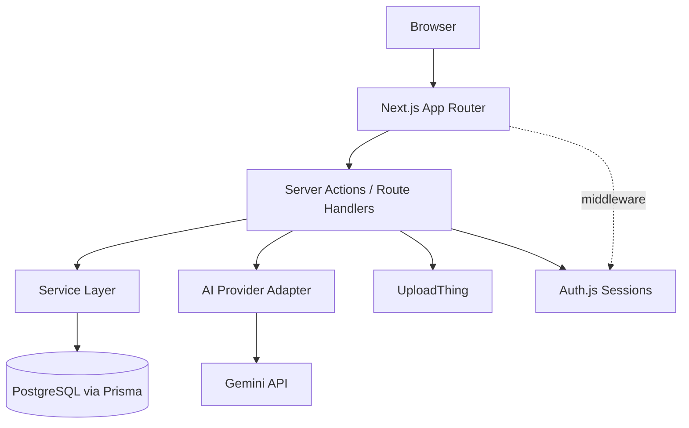
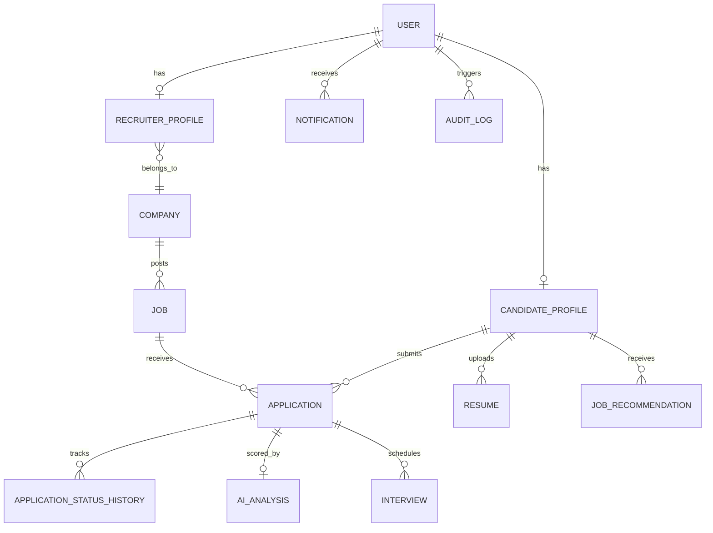

# Recruitment Platform

An AI-powered recruitment and talent-management platform connecting candidates, recruiters, and admins — built end-to-end with Next.js 15, TypeScript, PostgreSQL, and Google's Gemini for intelligent candidate-job matching.

**Live demo:** https://recruitment-platform-seven.vercel.app
**Repo:** https://github.com/safwanshaikh053/recruitment-platform

---

## Overview

Most job boards match on keywords. This platform scores every application against a job's actual requirements — skills, experience, education, and projects — using a transparent, weighted algorithm, then uses AI only to explain the score in plain language. The score itself is never a black box.

The result is a full three-sided marketplace:
- **Candidates** build a profile once, upload a resume, browse and apply to jobs, see their match score before a recruiter does, and track every application through to an offer.
- **Recruiters** post jobs, review applicants ranked by fit, move candidates through a hiring pipeline, and schedule interviews — all from one dashboard with real analytics.
- **Admins** moderate companies, manage user accounts, and review a full audit trail of platform activity.

## Live Demo

Register your own candidate and recruiter accounts directly on the live site — there's no shared demo login, since account creation and data are genuinely yours to test with. Admin access isn't self-serve by design (see *Authentication & Authorization* below); reach out if you'd like a guided walkthrough of the admin panel.

---

## Features

### Candidate
- Profile with skills (proficiency + years), education, experience, projects, certifications
- Resume upload (PDF) with automatic text extraction for AI matching
- Profile completion tracking with a weighted scoring breakdown
- Job search and browsing, with keyword and location filters
- One-click apply with an optional cover letter; active resume auto-attached
- Real-time AI match score per job, with matching/missing/preferred skill breakdown
- Personalized job recommendations, ranked and refreshable on demand
- Application tracking with full status history and withdrawal (while still unreviewed)
- Interview visibility — type, time, duration, and join link
- In-app notification center with unread tracking

### Recruiter
- Company profile creation (enters an admin-approval queue)
- Job posting with full requirements: skills (required/preferred), experience, education, salary range, employment type, work mode, deadline
- Full job lifecycle: Draft → Published → Closing Soon → Closed, enforced server-side as a real state machine
- Applicant review with AI match scores, resumes, cover letters, and skill breakdowns
- Hiring pipeline: Applied → Screening → Shortlisted → Interview → Offer → Hired (or Rejected from any active stage), with every transition audit-logged
- Interview scheduling with multiple interviewers, notes, and rescheduling
- Dashboard analytics: applications over time, hiring funnel, per-job performance

### Admin
- Platform-wide stats: users, candidates, recruiters, companies, jobs, applications, hires
- User management: suspend / reactivate accounts
- Company moderation: approve or reject pending companies
- Full audit log of every sensitive action taken on the platform
- Growth analytics: user, job, and application trends over time

---

## Tech Stack

| Layer | Choice | Why |
|---|---|---|
| Framework | Next.js 15 (App Router) | Server Components + Server Actions eliminate a separate API layer for most mutations |
| Language | TypeScript (strict) | End-to-end type safety from the database to the UI |
| Database | PostgreSQL (Neon, serverless) | Relational integrity for a genuinely relational domain (users, jobs, applications, pipelines) |
| ORM | Prisma | Type-safe queries, migrations as code |
| Auth | Auth.js v5 | Credentials-based sessions with role-based access control enforced at both middleware and server-action level |
| Validation | Zod | Every form and server action validates input server-side, never trusting the client |
| Styling | Tailwind CSS | Utility-first, pairs cleanly with a token-driven design system |
| AI | Google Gemini (`@google/genai`) | Behind a vendor-agnostic adapter — swapping providers means writing one new file, not touching business logic |
| File storage | UploadThing | Resumes never touch the app server's filesystem |
| Charts | Recharts | Dashboard analytics (funnels, trends) |
| Forms | React Hook Form | Client-side UX on top of server-side Zod validation |

## Architecture



Business logic lives in `services/`, never in route handlers or components. Server actions in `actions/` are thin wrappers: validate input with Zod, check authentication/role/ownership, call a service function, revalidate the affected path. UI components never query the database directly.

## Database Schema

Simplified to the core entities — the full schema (`prisma/schema.prisma`) has ~20 models including skills, education, certifications, interview participants, and notifications.



## Authentication & Authorization

- Credentials-based auth via Auth.js v5, passwords hashed with bcrypt
- Three roles: `CANDIDATE`, `RECRUITER`, `ADMIN` — admin accounts are never self-registered; promoting a user to admin is a deliberate manual step (via direct database access), not a public signup path
- **Two independent layers of protection**: `middleware.ts` blocks wrong-role navigation at the edge, and every server action/page independently re-verifies role and resource ownership before touching data — middleware is never the sole authorization boundary
- Ownership is always re-derived from the authenticated session server-side, never trusted from a client-submitted ID — a recruiter cannot act on another company's job even with a hand-crafted request

## AI Architecture

The match score is **deterministic, not AI-generated** — a documented, weighted formula:

| Factor | Weight |
|---|---|
| Required skills matched | 40% |
| Experience vs. minimum required | 25% |
| Projects relevant to required skills | 15% |
| Education requirement met | 10% |
| Preferred (nice-to-have) skills matched | 10% |

AI (Gemini) is used for exactly one thing: generating a 1–2 sentence plain-language explanation of the score. If the AI call fails or is rate-limited, a templated fallback explanation is used instead — the matching feature never breaks because of an AI outage.

Results are cached in the `AIAnalysis` table so the same candidate–job pair is never re-scored (and never re-billed) on every page view. The recommendation engine scores every published job deterministically (cheap, no AI calls), then only generates an AI explanation for the top 5 results — keeping well within free-tier rate limits regardless of platform size.

The AI provider itself sits behind a vendor-agnostic interface (`lib/ai/provider.ts`); swapping Gemini for another provider means adding one adapter file, not touching any matching or recommendation logic.

## Getting Started

### Prerequisites
- Node.js 18+
- A PostgreSQL database (this project uses [Neon](https://neon.tech)'s free tier)
- API keys: [Google AI Studio](https://aistudio.google.com) (free) for Gemini, [UploadThing](https://uploadthing.com) (free tier) for file storage

### Local setup

```bash
git clone https://github.com/safwanshaikh053/recruitment-platform.git
cd recruitment-platform
npm install
cp .env.example .env
```

Fill in `.env`:

```env
DATABASE_URL="your Neon pooled connection string"
DIRECT_URL="your Neon direct connection string"
AUTH_SECRET="generate with: node -e \"console.log(require('crypto').randomBytes(32).toString('base64'))\""
AI_PROVIDER="gemini"
AI_API_KEY="your Gemini API key"
UPLOADTHING_TOKEN="your UploadThing token"
NEXT_PUBLIC_APP_URL="http://localhost:3000"
```

Then:

```bash
npx prisma generate
npx prisma migrate dev
npm run dev
```

Visit `http://localhost:3000`.

### Verifying a build

```bash
npm run typecheck
npm run lint
npm run build
```

### Creating an admin account

Register a normal account through the UI, then open `npx prisma studio`, find that user in the `User` table, and change its `role` field to `ADMIN`.

---

## Project Structure

```
src/
├── app/            # Routes (App Router) — pages only, no business logic
├── actions/        # Server actions — validate, authorize, call services
├── services/       # All business logic and Prisma queries live here
├── components/
│   ├── ui/         # Design-system primitives (Button, Card, Badge, ...)
│   ├── forms/      # Client-side forms (React Hook Form)
│   ├── shared/     # Navbar, theme toggle, badges, etc.
│   └── dashboard/  # Chart components, stat cards
├── lib/
│   ├── auth/       # Auth.js config (edge-safe + full)
│   ├── ai/         # Vendor-agnostic AI provider interface + Gemini adapter
│   ├── db/         # Prisma client singleton
│   └── validation/ # Zod schemas
└── middleware.ts   # Edge-level route protection
```

## Known Limitations / Roadmap

Built in deliberately staged phases, with these intentionally deferred:

- **Automated testing** — no unit/integration/E2E test suite yet
- **Rate limiting & extended input hardening** — basic server-side validation exists everywhere (Zod on every action), but dedicated rate limiting on sensitive endpoints hasn't been added
- **Seed script / demo data** — accounts are created through normal registration rather than a pre-populated demo dataset
- **Document parsing beyond PDF** — resumes are PDF-only; `.docx` support is a reasonable next addition
- **Multi-interviewer availability / calendar sync** — interviews store a meeting link rather than integrating a calendar provider
